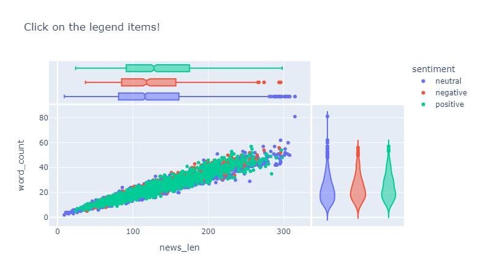
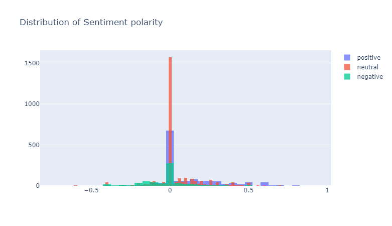
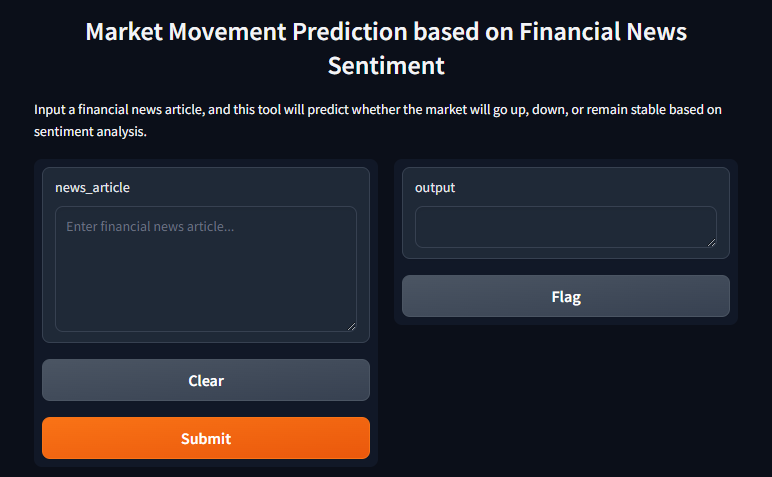

# 🚀 Finsen: Financial News Sentiment Analysis Model

<p align="center">
  
</p>

## 📊 About Finsen

Finsen is a financial news sentiment analysis model written in Python.
It's a simple model that is trained on headlines of financial news articles from the internet. It works by calculating the polarity of the news headlines and then classifying them into positive, negative or neutral.

## ✨ Features

- 📰 Analyze financial news articles from various sources
- 🔍 Extract key information and sentiment from news content
  

## 🛠️ Installation

1. Clone the repository:
   ```bash
   git clone https://github.com/root-Manas/finsen.git
   cd finsen
   ```

2. Create a virtual environment (optional but recommended):
   ```bash
   python -m venv venv
   source venv/bin/activate  # On Windows, use `venv\Scripts\activate`
   ```

3. Install the required packages:
   ```bash
   pip install -r models/requirements.txt
   ```

## 🚀 Usage

1. Ensure you're in the project directory and your virtual environment is activated (if used).

2. Run the Jupyter Notebook:
   ```bash
   jupyter notebook models/Finsen.ipynb
   ```

3. Follow the instructions in the notebook to analyze financial news and generate insights.

## 📦 Required Packages

Finsen relies on several Python packages to function. The main dependencies include:

- pandas
- numpy
- matplotlib
- scikit-learn
- gradio

For a complete list of dependencies, please refer to the `models/requirements.txt` file.

## 📈 Results

Here are some example outputs from the Finsen model:

### Sentiment Analysis Results


### Polarity of News Headlines


### Tool Usage


## 🤝 Contributing

We welcome contributions to Finsen! If you have suggestions for improvements or encounter any issues, please open an issue or submit a pull request.

## 📄 License

This project is licensed under the MIT License - see the [LICENSE](LICENSE) file for details.

## 🙏 Acknowledgements

- Thanks to all the open-source libraries that made this project possible.

---
